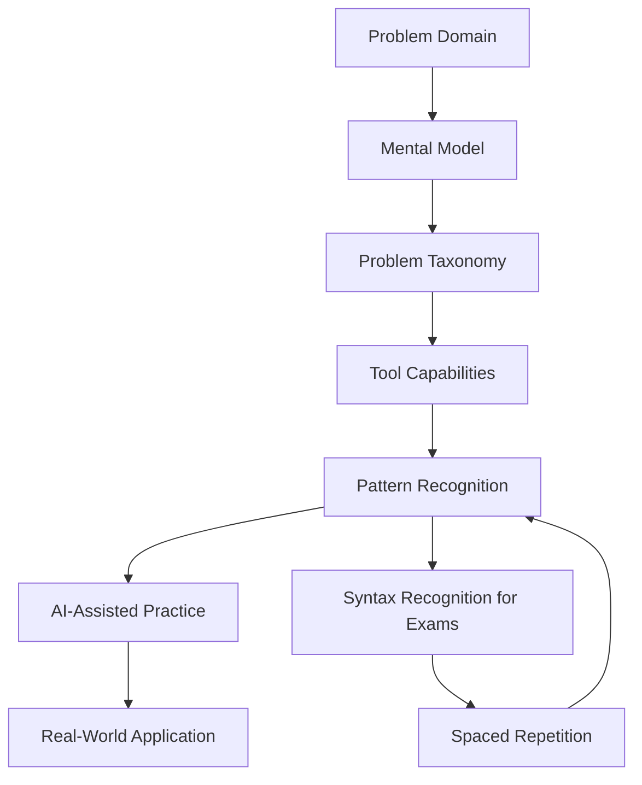

# Design Document: AI-Age Linux Learning System

## Overview

This design transforms a traditional Linux learning repository from a syntax-memorization approach to a modern AI-age learning system. The system recognizes that AI can generate syntax on demand, so it focuses human learning on:

1. **Conceptual understanding** - What problems can Linux solve?
2. **Recognition skills** - What does this code do?
3. **Problem-solution mapping** - Which tool for which problem?
4. **AI collaboration** - How to effectively direct AI to generate solutions?

The design applies cognitive load theory and spaced repetition principles while organizing knowledge around problems rather than commands.

### Practical Usage (Start Here!)

**Your daily workflow will be simple:**

1. **Pick a problem you want to solve** (e.g., "find large files")
2. **Read the problem guide** - Learn what's possible and which tools exist
3. **Practice recognition** - Look at examples and identify what they do
4. **Try it with AI** - Ask AI to generate the solution, then verify it works
5. **Document in your personal notes** - "I can now solve X using Y"

**The repository structure supports this by:**
- Organizing everything by problems (not commands)
- Providing simple templates you fill in as you learn
- Keeping your personal knowledge base minimal and practical
- Making it easy to find "how do I solve X?" instead of "what does command Y do?"

**You don't need to use everything** - start with just the problem guides and your personal notes. The rest is there when you need it.

## Architecture

### Simplified Structure (What You'll Actually Use)

```
linux-mastery/
├── problems/                # START HERE - Browse by problem type
│   ├── finding-files/
│   ├── managing-processes/
│   ├── text-processing/
│   └── ...
│
├── my-knowledge/           # YOUR personal notes (most important!)
│   ├── problems-i-solve.md    # Simple list: "I can do X"
│   ├── good-prompts.md        # AI prompts that worked
│   └── daily-log.md           # Quick daily notes
│
├── cert-prep/              # Only if doing certification
│   └── syntax-to-recognize.md # What to memorize for exams
│
└── references/             # Quick lookup when needed
    └── quick-reference.md  # Fast answers organized by problem
```

**That's it!** Everything else is optional. You'll spend 90% of your time in:
1. `problems/` - Learning what's possible
2. `my-knowledge/` - Building your personal reference

### Learning Flow



## Components and Interfaces

### 1. Knowledge Base Component

**Purpose**: Organize Linux knowledge by problems, not commands

**Structure**:
- `problems/` - Hierarchical problem taxonomies
- `patterns/` - Reusable patterns with use cases
- `mental-models/` - Core concepts (everything is a file, process lifecycle, etc.)
- `tools/` - Tool capabilities mapped to problem types

**Interface**:
```markdown
# Problem: [Problem Name]

## What problem does this solve?
[Clear description of the problem]

## When do you encounter this?
[Real-world scenarios]

## Available approaches:
1. **[Tool/Pattern Name]**
   - Best for: [use case]
   - Tradeoffs: [pros/cons]
   - Recognition: [how to identify in code]
   - AI prompt template: [how to ask AI]

## Decision tree:
[Flowchart or decision logic]

## Examples to recognize:
[Code snippets with explanations]
```

### 2. Learning Paths Component

**Purpose**: Guide learners through structured journeys

**Types**:
- **Conceptual paths**: Mental models → Problems → Tools → Patterns
- **Certification paths**: Recognition-focused with exam syntax
- **Project paths**: Real-world problem-solving scenarios

**Interface**:
```markdown
# Learning Path: [Path Name]

## Goal
[What you'll be able to do]

## Prerequisites
- Concepts: [required mental models]
- Recognition: [syntax you should recognize]

## Modules
1. **[Module Name]** (30 min)
   - Mental model: [concept]
   - Problems covered: [list]
   - Recognition practice: [exercises]
   - AI collaboration: [practice scenarios]
   - Checkpoint: [verification questions]

## Completion criteria
- [ ] Can explain mental model
- [ ] Can identify problems this solves
- [ ] Can recognize patterns in code
- [ ] Can direct AI to generate solutions
```

### 3. Exercise Component

**Purpose**: Provide varied practice types

**Exercise Types**:

**Recognition Exercises**:
```markdown
# Recognition Exercise: [Topic]

## Code Sample
```bash
[code snippet]
```

## Questions
1. What problem is this solving?
2. What pattern/idiom is being used?
3. What would happen if...?
4. When would you use this approach?

## Verification
[Explanation of what the code does and why]
```

**Problem-Solving Exercises**:
```markdown
# Problem-Solving Exercise: [Scenario]

## Scenario
[Real-world problem description]

## Your task
1. Identify the problem type
2. Choose appropriate approach
3. Write AI prompt to generate solution
4. Verify AI output
5. Explain why this approach works

## Success criteria
- Correct problem identification
- Appropriate tool selection
- Effective AI prompt
- Accurate verification
```

**AI-Assisted Exercises**:
```markdown
# AI Collaboration Exercise: [Task]

## Problem
[Description]

## Steps
1. Analyze the problem (don't look up syntax yet)
2. Identify which Linux capabilities you need
3. Write a prompt for AI
4. Review AI's solution
5. Test and verify
6. Document what you learned

## Reflection
- What did you need to know to direct AI effectively?
- How did you verify the solution was correct?
- What would you do differently next time?
```

### 4. Reference Component

**Purpose**: Quick lookup organized by problem type

**Structure**:
```markdown
# Quick Reference: [Problem Type]

## Common scenarios
- [Scenario 1] → [Tool/Pattern]
- [Scenario 2] → [Tool/Pattern]

## Recognition patterns
- If you see `[pattern]` → It's doing [action]
- If you see `[pattern]` → It's solving [problem]

## AI prompt templates
- "I need to [problem], using [constraints]"
- "Explain what this does: [code]"
- "Show me how to [task] with [tool]"

## Memorize (for exams)
- [Concept 1]
- [Concept 2]

## Look up as needed
- [Syntax detail 1]
- [Syntax detail 2]
```

### 5. Personal Knowledge Base Component

**Purpose**: Learner's own problem-solution mappings

**Structure**:
```markdown
# My Problem-Solution Map

## Problems I Can Solve

### [Problem Category]
- **Problem**: [Description]
- **My approach**: [Tool/pattern I use]
- **AI prompt that works**: [Effective prompt]
- **When I use this**: [Scenarios]
- **Related patterns**: [Links to other solutions]

## Effective AI Prompts
[Collection of prompts that worked well]

## Patterns I Recognize
[Patterns I've encountered and understood]
```

## Data Models

### Problem Taxonomy Model

```yaml
problem:
  id: string
  name: string
  category: string  # filesystem, process, network, text, etc.
  description: string
  scenarios: string[]
  tools: Tool[]
  patterns: Pattern[]
  mental_model: string  # link to mental model
  difficulty: enum  # novice, intermediate, advanced
  exam_relevant: boolean
```

### Tool Model

```yaml
tool:
  name: string
  purpose: string  # what problem it solves
  use_cases: string[]
  tradeoffs: string
  recognition_hints: string[]  # how to identify in code
  ai_prompt_template: string
  related_tools: string[]
  exam_syntax: string[]  # syntax to recognize for exams
  memorize: boolean  # whether to memorize or just recognize
```

### Pattern Model

```yaml
pattern:
  name: string
  category: string  # idiom, pipeline, redirection, etc.
  description: string
  when_to_use: string
  examples: Example[]
  variations: string[]
  recognition_key: string  # what to look for
```

### Learning Module Model

```yaml
module:
  id: string
  name: string
  path_type: enum  # conceptual, certification, project
  duration_minutes: number
  prerequisites:
    concepts: string[]
    recognition: string[]
  content:
    mental_model: string
    problems: string[]
    tools: string[]
    patterns: string[]
  exercises:
    recognition: string[]
    problem_solving: string[]
    ai_assisted: string[]
  checkpoint_questions: Question[]
  completion_criteria: string[]
```

### Exercise Model

```yaml
exercise:
  id: string
  type: enum  # recognition, problem_solving, ai_assisted
  difficulty: enum
  time_estimate: number
  problem_domain: string
  content: string
  questions: Question[]
  success_criteria: string[]
  spaced_repetition: boolean  # for exam prep
```

## Correctness Properties

*A property is a characteristic or behavior that should hold true across all valid executions of a system—essentially, a formal statement about what the system should do. Properties serve as the bridge between human-readable specifications and machine-verifiable correctness guarantees.*

### Property 1: Problem-first organization

*For any* learning module or reference document, the primary organization SHALL be by problem type rather than by command name or alphabetical order.

**Validates: Requirements 1.4, 3.1**

### Property 2: Recognition over recall

*For any* exercise set, the ratio of recognition exercises (identifying what code does) to recall exercises (writing code from memory) SHALL be at least 2:1.

**Validates: Requirements 2.1, 2.5**

### Property 3: Conceptual prerequisites

*For any* learning module that introduces tools or syntax, there SHALL exist a prerequisite mental model or concept explanation that learners must complete first.

**Validates: Requirements 5.1, 5.5**

### Property 4: AI collaboration integration

*For any* problem-solving exercise, there SHALL be a component that requires learners to practice directing AI and verifying AI-generated solutions.

**Validates: Requirements 4.1, 4.5**

### Property 5: Explicit memorization guidance

*For any* content that includes syntax or commands, there SHALL be explicit marking of what should be memorized versus what can be looked up.

**Validates: Requirements 6.1, 6.2, 6.3**

### Property 6: Problem-solution mapping completeness

*For any* problem taxonomy, all leaf nodes (specific problems) SHALL map to at least one tool or pattern that solves that problem.

**Validates: Requirements 3.1, 3.5**

### Property 7: Pattern context inclusion

*For any* pattern or idiom documented, there SHALL be an explanation of when and why to use it, not just what it does.

**Validates: Requirements 10.2, 10.4**

### Property 8: Certification syntax coverage

*For any* certification-focused learning path, all exam-relevant syntax SHALL be included in recognition exercises with spaced repetition.

**Validates: Requirements 7.1, 7.2, 7.3**

### Property 9: Real-world scenario grounding

*For any* exercise, there SHALL be a real-world scenario or use case that contextualizes why this knowledge matters.

**Validates: Requirements 8.1, 8.3**

### Property 10: Personal knowledge base structure

*For any* personal knowledge base template, the organization SHALL be by problems the learner can solve, not by topics studied.

**Validates: Requirements 9.2, 9.3**

## Error Handling

### Learning Path Errors

**Missing Prerequisites**:
- Detection: Check if prerequisite concepts/modules are marked complete
- Handling: Display warning and link to prerequisite content
- User action: Complete prerequisites or acknowledge risk

**Incomplete Exercises**:
- Detection: Track exercise completion status
- Handling: Highlight incomplete exercises in module summary
- User action: Complete or skip with acknowledgment

### Content Organization Errors

**Broken Links**:
- Detection: Validate all internal links during content updates
- Handling: Log broken links and display warning
- User action: Fix links or remove references

**Missing Problem Mappings**:
- Detection: Verify all tools map to at least one problem
- Handling: Flag unmapped tools in content audit
- User action: Add problem mappings or remove tool

### Exercise Validation Errors

**Incorrect Problem Identification**:
- Detection: Compare learner's answer to expected problem type
- Handling: Provide feedback explaining correct problem type
- User action: Review problem taxonomy and retry

**Ineffective AI Prompts**:
- Detection: Learner reports AI generated incorrect solution
- Handling: Provide prompt refinement guidance
- User action: Refine prompt and retry

## Testing Strategy

### Unit Testing

**Content Structure Tests**:
- Verify all learning modules have required sections
- Validate problem taxonomy completeness
- Check that all tools have problem mappings
- Ensure all patterns have use case explanations

**Link Validation Tests**:
- Test all internal links resolve correctly
- Verify external resources are accessible
- Check that all references point to existing content

**Template Compliance Tests**:
- Verify exercises follow correct template format
- Check that learning modules include all required components
- Validate personal knowledge base structure

### Property-Based Testing

The system will use property-based testing to verify correctness properties across all content. We'll use a markdown parsing library appropriate for the implementation language.

**Property Test 1: Problem-first organization**
- **Feature: ai-age-linux-learning, Property 1: Problem-first organization**
- Generate: Random learning modules and reference documents
- Test: Primary organization key is problem type, not command name
- Validates: Requirements 1.4, 3.1

**Property Test 2: Recognition ratio**
- **Feature: ai-age-linux-learning, Property 2: Recognition over recall**
- Generate: Random exercise sets
- Test: Count recognition vs recall exercises, verify ratio >= 2:1
- Validates: Requirements 2.1, 2.5

**Property Test 3: Conceptual prerequisites**
- **Feature: ai-age-linux-learning, Property 3: Conceptual prerequisites**
- Generate: Random learning modules with tool/syntax content
- Test: Verify prerequisite mental model exists and is linked
- Validates: Requirements 5.1, 5.5

**Property Test 4: AI collaboration integration**
- **Feature: ai-age-linux-learning, Property 4: AI collaboration integration**
- Generate: Random problem-solving exercises
- Test: Verify presence of AI direction and verification components
- Validates: Requirements 4.1, 4.5

**Property Test 5: Explicit memorization guidance**
- **Feature: ai-age-linux-learning, Property 5: Explicit memorization guidance**
- Generate: Random content with syntax/commands
- Test: Verify explicit "memorize" or "look up" marking exists
- Validates: Requirements 6.1, 6.2, 6.3

**Property Test 6: Problem-solution mapping completeness**
- **Feature: ai-age-linux-learning, Property 6: Problem-solution mapping completeness**
- Generate: Random problem taxonomies
- Test: All leaf nodes have at least one tool/pattern mapping
- Validates: Requirements 3.1, 3.5

**Property Test 7: Pattern context inclusion**
- **Feature: ai-age-linux-learning, Property 7: Pattern context inclusion**
- Generate: Random pattern documents
- Test: Verify "when to use" and "why" sections exist
- Validates: Requirements 10.2, 10.4

**Property Test 8: Certification syntax coverage**
- **Feature: ai-age-linux-learning, Property 8: Certification syntax coverage**
- Generate: Random certification learning paths
- Test: All exam-relevant syntax appears in recognition exercises
- Validates: Requirements 7.1, 7.2, 7.3

**Property Test 9: Real-world scenario grounding**
- **Feature: ai-age-linux-learning, Property 9: Real-world scenario grounding**
- Generate: Random exercises
- Test: Verify presence of real-world scenario or use case
- Validates: Requirements 8.1, 8.3

**Property Test 10: Personal knowledge base structure**
- **Feature: ai-age-linux-learning, Property 10: Personal knowledge base structure**
- Generate: Random personal knowledge base entries
- Test: Verify organization by problems solved, not topics studied
- Validates: Requirements 9.2, 9.3

### Integration Testing

**Learning Path Flow**:
- Complete a full learning module end-to-end
- Verify prerequisite checking works
- Test exercise completion tracking
- Validate checkpoint questions

**Cross-Reference Integrity**:
- Test that problem → tool → pattern links work bidirectionally
- Verify mental model references resolve correctly
- Check that related content suggestions are valid

**Spaced Repetition System**:
- Test that exam syntax cards are scheduled correctly
- Verify repetition intervals increase appropriately
- Check that completed cards are marked correctly

### User Acceptance Testing

**Conceptual Understanding**:
- Can learners explain mental models in their own words?
- Can they identify problems from descriptions?
- Can they choose appropriate tools for scenarios?

**Recognition Skills**:
- Can learners identify what code does without running it?
- Can they spot common patterns in unfamiliar code?
- Can they explain why a particular approach was chosen?

**AI Collaboration**:
- Can learners write effective prompts for AI?
- Can they verify AI-generated solutions?
- Can they refine prompts when initial results are poor?

**Certification Readiness**:
- Can learners recognize exam-relevant syntax?
- Do they know what to memorize vs look up?
- Can they pass practice exams?

## Implementation Notes

### Technology Choices

**Content Format**: Markdown with YAML frontmatter
- Easy to edit and version control
- Supports linking between documents
- Can be parsed for validation

**Knowledge Organization**: Zettelkasten-inspired linking
- Bidirectional links between related concepts
- Problem-oriented index notes
- Emergent structure through connections

**Spaced Repetition**: Simple markdown-based system
- Cards in `references/syntax-cards/`
- Frontmatter tracks next review date
- Script to generate daily review list

**Validation**: Python scripts for property testing
- Parse markdown files
- Validate structure and links
- Check property compliance

### Migration Strategy

**Phase 1: Create New Structure**
- Set up new directory structure
- Create templates for each component type
- Build initial problem taxonomy

**Phase 2: Transform Existing Content**
- Identify problems solved by current topics
- Reorganize content by problem type
- Add mental models and decision trees
- Create recognition exercises from existing examples

**Phase 3: Add AI Collaboration**
- Create AI prompt templates
- Add verification exercises
- Build personal knowledge base templates

**Phase 4: Certification Integration**
- Identify exam-relevant syntax
- Create recognition exercises
- Set up spaced repetition system

### Content Creation Workflow

1. **Identify Problem Domain**
   - What problems exist in this area?
   - Create problem taxonomy

2. **Document Mental Model**
   - What's the underlying concept?
   - How does Linux think about this?

3. **Map Tools to Problems**
   - Which tools solve which problems?
   - What are the tradeoffs?

4. **Extract Patterns**
   - What common idioms exist?
   - When is each pattern used?

5. **Create Exercises**
   - Recognition: What does this code do?
   - Problem-solving: Which approach for this scenario?
   - AI-assisted: Direct AI to solve this problem

6. **Build References**
   - Quick lookup by problem type
   - Mark what to memorize
   - Create syntax cards for exam prep

### Simplified Daily Practice (Actually Doable)

**Daily (20-30 min total)**:

1. **Pick one problem** from `problems/` folder (5 min)
   - Example: "I want to learn how to find large files"

2. **Read and understand** (10 min)
   - What problem does this solve?
   - What tools exist for this?
   - Look at 2-3 examples - what do they do?

3. **Try it yourself** (10 min)
   - Ask AI: "Show me how to find files larger than 100MB"
   - Run the command AI gives you
   - Verify it works
   - Try to understand WHY it works

4. **Document** (5 min)
   - Add to `my-knowledge/problems-i-solve.md`: "Find large files → use find with -size"
   - Save the AI prompt if it worked well
   - Done!

**That's it!** No complex tracking, no elaborate exercises. Just:
- Learn one problem
- Try it with AI
- Document what you learned
- Repeat tomorrow

### Concrete Example: Your First Day

**Day 1: Learning to find large files**

1. Open `problems/finding-files/large-files.md`
2. Read: "This solves the problem of finding files that take up disk space. Common tools: find, du"
3. See examples:
   ```bash
   find /home -size +100M  # What does this do? Find files over 100MB
   du -sh * | sort -h      # What does this do? Show directory sizes, sorted
   ```
4. Ask AI: "Show me how to find all files larger than 500MB in my home directory"
5. AI gives you: `find ~ -type f -size +500M`
6. Try it, it works!
7. Add to `my-knowledge/problems-i-solve.md`:
   ```markdown
   ## Finding Large Files
   - Problem: Need to free up disk space
   - Solution: Use `find` with `-size` flag
   - AI prompt that worked: "Show me how to find files larger than X in directory Y"
   - When I use this: When disk is full, need to clean up
   ```

**Tomorrow**: Pick a different problem. Build your knowledge one problem at a time.

## Future Enhancements

### Interactive Components

- Web-based problem taxonomy browser
- Interactive decision trees
- Code recognition quiz generator
- AI prompt effectiveness tracker

### Community Features

- Share effective AI prompts
- Contribute problem-solution mappings
- Peer review of personal knowledge bases
- Collaborative pattern library

### Advanced Learning

- Adaptive difficulty based on performance
- Personalized learning paths
- Integration with actual AI coding assistants
- Real-time code recognition practice

### Analytics

- Track which problems you can solve
- Measure recognition accuracy over time
- Identify knowledge gaps
- Optimize spaced repetition intervals
